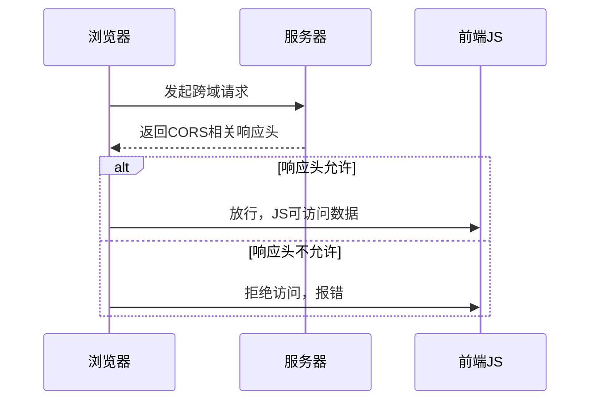

好的，下面我将用简明的中文梳理 CORS（跨域资源共享，Cross-Origin Resource Sharing）相关方的知识，并给出形式化的论证结构。

---

## 一、CORS 相关方知识梳理

### 1. 相关方（Stakeholders）

- **浏览器（客户端）**  
  负责发起跨域请求，并根据 CORS 规则决定是否允许前端 JavaScript 访问响应内容。

- **前端应用（JavaScript）**  
  通过 AJAX、fetch、XHR 等方式发起跨域 HTTP 请求。

- **服务器（API 服务端）**  
  接收跨域请求，根据自身策略在响应头中返回 CORS 相关字段，决定是否允许跨域访问。

- **资源拥有者**  
  拥有被请求资源的服务器或服务，决定资源的访问策略。

- **用户**  
  通过前端应用间接发起跨域请求，受 CORS 策略保护其数据安全。

---

### 2. 主要知识点

- **同源策略（Same-Origin Policy）**  
  浏览器的安全机制，默认禁止不同源（协议+域名+端口）之间的资源访问。

- **CORS 机制**  
  允许服务器声明哪些源可以访问资源，浏览器据此放行或拦截响应。

- **预检请求（Preflight Request）**  
  对于非简单请求，浏览器会先发送 OPTIONS 请求，询问服务器是否允许。

- **CORS 相关 HTTP 头**  
  - `Access-Control-Allow-Origin`
  - `Access-Control-Allow-Methods`
  - `Access-Control-Allow-Headers`
  - `Access-Control-Allow-Credentials`
  - `Access-Control-Expose-Headers`
  - `Access-Control-Max-Age`

---

## 二、CORS 形式化论证

### 1. 形式化符号定义

- 设  
  - \( O \)：Origin（请求源）  
  - \( R \)：Resource（被请求资源）  
  - \( S \)：Server（资源服务器）  
  - \( B \)：Browser（浏览器）  
  - \( H \)：HTTP 响应头  
  - \( P \)：Policy（服务器策略）

### 2. 论证结构

#### 命题1：  
**若** \( O \neq R \)（即跨域），**则** B 拒绝访问，除非 S 明确允许。

#### 形式化表达：  
\[
\forall O, R, S, B, H, P, \\
O \neq R \implies \left\{
  \begin{array}{ll}
    \text{若 } S \text{ 响应 } H \text{ 满足 } P(O) = \text{允许} \\
    \quad \implies B \text{ 允许访问} \\
    \text{否则} \\
    \quad \implies B \text{ 拒绝访问}
  \end{array}
\right.
\]

#### 命题2：  
**若** 请求为非简单请求，**则** B 先发起预检（OPTIONS），S 必须在响应中声明允许，否则 B 拒绝主请求。

#### 形式化表达：  
\[
\text{非简单请求} \implies B \xrightarrow{OPTIONS} S \\
S \xrightarrow{H} B \\
H \text{ 满足 } P(O) = \text{允许} \implies B \text{继续主请求} \\
\text{否则 } B \text{拒绝}
\]

#### 命题3：  
**CORS 保护目标**：  
- 防止恶意网站在用户不知情的情况下，跨域获取敏感数据。

#### 形式化表达：  
\[
\text{CORS} \implies \neg (\text{任意 } O \text{ 可访问 } R)
\]

---

## 三、总结

- CORS 是浏览器、前端、服务器三方协作的安全机制。
- 服务器通过响应头声明允许的跨域策略，浏览器严格执行。
- 形式化论证可归纳为“服务器声明—浏览器判断—前端受限”三步闭环。

如需更详细的某一方机制或代码实现示例，请告知！

CORS（跨域资源共享，Cross-Origin Resource Sharing）是浏览器的一种安全机制，用于允许或限制不同源（协议+域名+端口）之间的资源请求。其核心目的是保护用户数据安全，防止恶意网站在用户不知情的情况下获取敏感信息。

---

## 一、同源策略（SOP）基础

- **同源策略**：浏览器默认只允许同源（协议、域名、端口都相同）的页面之间进行资源访问。
- **跨域**：只要协议、域名或端口有一个不同，就是跨域。

---

## 二、CORS 跨域原理

### 1. 角色

- **浏览器**：发起请求并根据 CORS 规则决定是否允许前端 JS 访问响应内容。
- **前端应用**：通过 JS（如 fetch、XHR）发起跨域 HTTP 请求。
- **服务器**：通过响应头决定是否允许跨域访问。

### 2. 工作流程

#### （1）简单请求

- 浏览器直接发起跨域请求（如 GET/POST，且 Content-Type 为常见类型）。
- 服务器在响应头中返回 `Access-Control-Allow-Origin`（指定允许的源）。
- 浏览器检查响应头，如果允许，则前端 JS 可以访问响应内容，否则被拦截。

#### （2）预检请求（Preflight）

- 对于“非简单请求”（如自定义头、PUT/DELETE、带 credentials），浏览器会先自动发送一个 `OPTIONS` 请求（预检）。
- 服务器需在预检响应中返回允许的源、方法、头等信息。
- 预检通过后，浏览器才会发起真正的跨域请求。

#### （3）带 Cookie 的跨域

- 前端请求需设置 `credentials: 'include'`。
- 服务器响应头需有 `Access-Control-Allow-Credentials: true`，且 `Access-Control-Allow-Origin` 不能为 `*`，必须为具体源。

---

### 3. 关键响应头

- `Access-Control-Allow-Origin`：允许的源（如 `http://localhost:3000`）。
- `Access-Control-Allow-Methods`：允许的方法（如 `GET, POST`）。
- `Access-Control-Allow-Headers`：允许的自定义请求头。
- `Access-Control-Allow-Credentials`：是否允许携带 Cookie。
- `Access-Control-Expose-Headers`：允许前端 JS 访问的响应头。
- `Access-Control-Max-Age`：预检请求结果缓存时间。

---

## 三、CORS 保护目标

- 防止恶意网站在用户不知情的情况下，跨域获取敏感数据。
- 让资源拥有者（服务器）有权决定哪些外部源可以访问自己的资源。

---

## 四、流程图（简化）

---

如需更详细的技术细节、代码示例或安全分析，请随时告知！