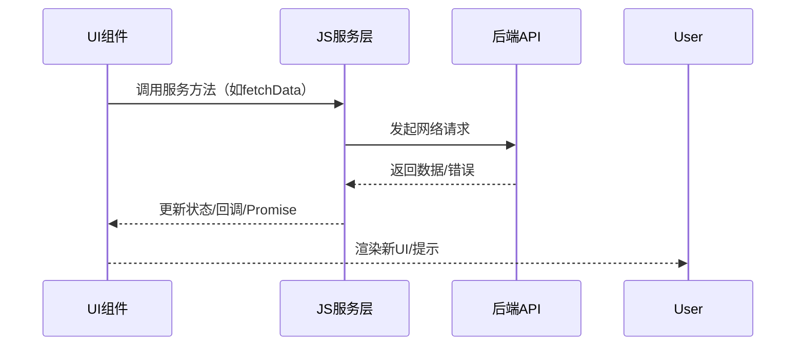

# WEB前端JS组件与服务最佳实践与模式

## 1. 组件开发最佳实践

### 1.1 组件设计原则
- 单一职责：每个组件只做一件事
- 高内聚低耦合：组件内部自洽，外部依赖最小
- 可复用性：参数化、组合化、无副作用
- 可测试性：支持单元测试、快照测试
- 可访问性（a11y）：语义化标签、键盘操作、ARIA支持
- 响应式设计：适配多端、断点、容器查询

### 1.2 组件目录结构示例
```
Button/
  ├─ index.tsx
  ├─ Button.tsx
  ├─ Button.test.tsx
  ├─ Button.stories.tsx
  ├─ style.module.css
  └─ README.md
```

---

## 2. 服务层开发最佳实践

### 2.1 服务设计原则
- 单一数据源：服务只负责一类数据/业务
- 解耦UI：服务与UI分离，便于复用和测试
- 状态管理：集中管理、可追踪、可回溯
- 错误处理：统一异常捕获与提示
- 副作用隔离：网络、存储等副作用集中管理

### 2.2 服务层结构示例
```
services/
  ├─ userService.ts
  ├─ productService.ts
  ├─ orderService.ts
  └─ index.ts
```

---

## 3. 常用设计模式

### 3.1 组件模式
- **高阶组件（HOC）**：复用逻辑，增强组件
- **渲染属性（Render Props）**：通过函数传递渲染逻辑
- **自定义Hook**：封装状态与副作用逻辑
- **受控/非受控组件**：表单、输入等
- **复合组件**：父子协作、插槽模式

### 3.2 服务模式
- **单例模式**：全局唯一服务实例（如全局状态）
- **观察者模式**：事件订阅/发布（如EventEmitter）
- **工厂模式**：动态创建服务/对象
- **中间件模式**：请求/响应拦截、链式处理

---

## 4. 组件-服务协作可视化流程



---

## 5. 总结与建议
- 组件与服务应分层解耦，接口清晰，便于维护和扩展。
- 建议团队统一目录结构、命名规范、测试与文档标准。
- 善用设计模式提升代码复用性与可维护性。
- 持续优化协作流程，提升开发效率与产品质量。 