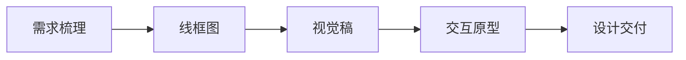

# UI设计流程与交付全链路梳理

## 1. 设计全流程概览

---

## 2. 需求梳理（Requirement Analysis）
- **目标**：明确产品定位、用户需求、业务目标、功能范围。
- **方法**：
  - 竞品分析、用户访谈、头脑风暴、需求文档（PRD）
  - 用户画像、用户旅程地图、场景故事板
- **输出**：需求清单、功能优先级、用户故事、流程图

### 形式化表达：
- 设 $R = \{r_1, r_2, ..., r_n\}$ 为需求集合
- 需求优先级排序 $P: R \rightarrow \mathbb{N}$
- 用户目标 $U = \{u_1, u_2, ...\}$

---

## 3. 线框图（Wireframe）
- **目标**：低保真表达页面结构、信息层级、主要交互
- **方法**：
  - 手绘/白板、Figma/Sketch低保真、Balsamiq
  - 只用灰色块、占位符、简单图标
- **输出**：页面布局草图、功能区块、初步交互流

### 形式化表达：
- 页面元素集合 $E = \{e_1, e_2, ..., e_m\}$
- 元素属性 $A(e_i) = (type, position, size, hierarchy)$
- 页面流转 $F: E \rightarrow E$

---

## 4. 视觉稿（Visual Design）
- **目标**：高保真展现品牌风格、色彩、字体、图标、图片等视觉细节
- **方法**：
  - Figma/Sketch高保真、设计系统、色板/字体/组件库
  - 设计评审、风格统一、响应式适配
- **输出**：高保真页面、主视觉、组件规范、设计规范文档

### 形式化表达：
- 视觉属性 $V(e_i) = (color, font, icon, image, shadow, border)$
- 设计系统 $DS = (Color, Font, Icon, Component, Grid, Token)$

---

## 5. 交互原型（Interactive Prototype）
- **目标**：模拟真实交互体验，验证流程与动效
- **方法**：
  - Figma Prototype、Axure、Framer、Principle
  - 动效、过渡、点击/滑动/输入等交互
  - 可用性测试、用户反馈收集
- **输出**：可交互原型、动效演示、交互说明文档

### 形式化表达：
- 交互事件 $I = \{i_1, i_2, ..., i_k\}$
- 状态转移 $T: (E, I) \rightarrow E'$
- 动效参数 $M(i_j) = (duration, easing, delay)$

---

## 6. 设计交付（Design Handoff）
- **目标**：高效、无歧义地将设计成果交付开发，实现还原
- **方法**：
  - Figma Inspect、Zeplin、标注、切图、设计token导出
  - 交付文档、组件库、设计系统同步
  - 设计-开发评审、版本管理、问题追踪
- **输出**：标注稿、切图、设计token、交付文档、开发可用组件

### 形式化表达：
- 交付集合 $D = (Visual, Spec, Asset, Token, Doc)$
- 交付映射 $H: (DS, E, V, I) \rightarrow D$

---

## 7. 总结与建议
- UI设计全链路需环环相扣，前后衔接，持续迭代。
- 建议团队建立标准化流程、模板和设计系统，提升效率与交付质量。
- 设计交付后应持续跟进开发还原度与用户反馈，闭环优化。 